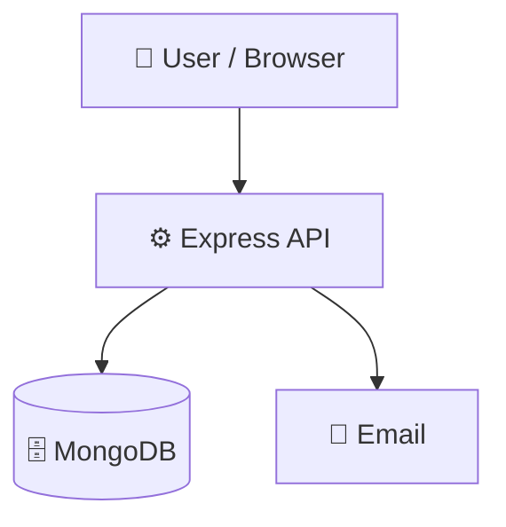

# EventFlow-Mern-Event-Booking

## 📝 Description

A full-stack Event Management System built using the MERN stack (MongoDB, Express.js, React.js, Node.js) that allows users to explore, book, and manage events seamlessly.

## 🛠️ Tech Stack

    

**Notable libraries:** Mongoose, Nodemailer

## 🏗️ Architecture

A high-level view of how the main pieces fit together:



# 1. Clone the repository
git clone https://github.com/Chandangorain/EventFlow-Mern-Event-Booking.git

# 2. Install dependencies
npm install

# 3. Start the dev server
npm run start
```

## 📦 Key Dependencies

```
bcryptjs: ^3.0.3
cors: ^2.8.6
dotenv: ^17.4.2
express: ^5.2.1
jsonwebtoken: ^9.0.3
mongoose: ^9.5.0
nodemailer: ^8.0.5
```

## 🚀 Available Scripts

- **start** — `npm run start`
- **dev** — `npm run dev`
- **test** — `npm run test`

## 📁 Project Structure

```
.
├── LICENSE
├── client
│   ├── index.html
│   ├── package.json
│   ├── postcss.config.js
│   ├── src
│   │   ├── App.jsx
│   │   ├── assets
│   │   │   ├── hero.png
│   │   │   ├── react.svg
│   │   │   └── vite.svg
│   │   ├── components
│   │   │   └── Navbar.jsx
│   │   ├── context
│   │   │   └── AuthContext.jsx
│   │   ├── index.css
│   │   ├── main.jsx
│   │   ├── pages
│   │   │   ├── AdminDashboard.jsx
│   │   │   ├── EventDetail.jsx
│   │   │   ├── Home.jsx
│   │   │   ├── Login.jsx
│   │   │   ├── PaymentFailed.jsx
│   │   │   ├── PaymentSuccess.jsx
│   │   │   ├── Register.jsx
│   │   │   └── UserDashboard.jsx
│   │   └── utils
│   │       └── axios.js
│   ├── tailwind.config.js
│   └── vite.config.js
├── package.json
└── server
    ├── config
    │   └── db.js
    ├── controllers
    │   ├── authController.js
    │   ├── bookingController.js
    │   └── eventController.js
    ├── index.js
    ├── middleware
    │   └── auth.js
    ├── models
    │   ├── Booking.js
    │   ├── User.js
    │   ├── event.js
    │   └── otp.js
    ├── routes
    │   ├── auth.js
    │   ├── booking.js
    │   └── events.js
    ├── seed.js
    └── utils
        └── email.js
```

## 🛠️ Development Setup

### Node.js / JavaScript
1. Install Node.js (v18+ recommended)
2. Install dependencies: `npm install` (or `yarn` / `pnpm install` / `bun install`)
3. Start the dev server: see the **Quick Start** above

## 📜 License

This project is licensed under the **ISC** License.

---

<div align="center">

[](https://readmebuddy.com)

<sub>Generate beautiful READMEs in seconds → <a href="https://readmebuddy.com">readmebuddy.com</a></sub>

</div>
